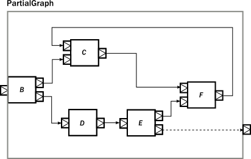
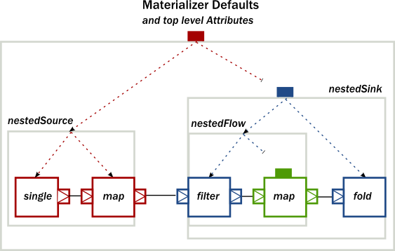

# Modularity, Composition and Hierarchy

## Introduction

Akka Streams提供了一个统一的流处理图模型，它允许灵活地组成可重用的组件。在这一章中，我们从概念和API的角度展示了这些组件的样子，展示了库的模块化方面

## Basics of composition and modularity

Akka Streams中使用的每一个操作符都可以被想象成一个具有输入和输出端口的 "盒子"，要处理的元素到达和离开操作符。在这种观点中，一个Source无非是一个只有一个输出端口的 "盒子"，或者说，一个BidiFlow就是一个正好有两个输入端口和两个输出端口的 "盒子"。在下图中，我们说明了最常用的被看成 "盒子 "的运算符


线性运算符是Source、Sink和Flow，因为它们可以用来组成严格的运算符链。Fan-in和Fan-out运算符通常有多个输入或多个输出端口，因此它们允许构建更复杂的图形布局，而不仅仅是链。BidiFlow运算符通常在IO相关的任务中很有用，在这些任务中，有输入和输出通道需要处理。由于BidiFlow的特殊形状，很容易将它们堆叠在一起，例如建立一个分层协议。例如Akka中的TLS支持就是以BidiFlow的形式实现的

这些可重复使用的组件已经可以创建复杂的处理网络。但我们目前所看到的并没有实现模块化。例如，最好是将一个较大的图实体打包成一个可重用的组件，并将其内部隐藏起来，只暴露出与模块用户交互的端口。一个很好的例子是Http服务器组件，它的内部编码为BidiFlow，它使用输入输出端口对与客户端TCP连接进行接口，接受和发送ByteString s，而它的上层端口发射和接收HttpRequest和HttpResponse实例

下图演示了各种复合运算符，这些运算符内部包含了各种其他类型的运算符，但将它们隐藏在一个看起来像Source、Flow等的形状后面


上面一个有趣的例子是一个Flow，它由一个断开的Sink和Source组成。这可以通过使用Flow上的fromSinkAndSource()构造方法来实现，该方法将这两个部分作为参数

请注意，当使用该方法组合一个Flow时，终止信号不会 "通过"，因为Sink和Source被假定为完全独立。然而，如果你想构造一个像这样的Flow，但需要终止事件来触发复合流的 "另一边"，你可以使用Flow.fromSinkAndSourceCoupled或Flow.fromSinkAndSourceCoupledMat来做到这一点。例如，取消复合流的源端将导致其汇端的完成

BidiFlow这个例子说明了一个模块内部可以是任意复杂的，暴露的端口可以灵活的布线。唯一的约束条件是，封闭模块的所有端口必须相互连接，或者作为接口端口暴露出来，而且这种端口的数量需要符合形状的要求，例如一个Source只允许一个暴露的输出端口，其余的内部端口必须正确连接

这些机制允许模块的任意嵌套。例如，下图演示了一个RunnableGraph，它是由一个复合Source和一个复合Sink（它又包含一个复合Flow）构建的


上图中还有一种形状我们还没有见过，它叫做RunnableGraph。原来，如果我们把所有暴露的端口都连在一起，使不再有开放的端口存在，我们就会得到一个封闭的模块，这就是RunnableGraph类。这就是RunnableGraph类所代表的内容。这是一个Materializer可以采取的形状，并变成一个执行所述任务的运行实体的网络。事实上，RunnableGraph本身就是一个模块，而且（也许有点令人惊讶）它可以作为更大的图的一部分。将一个封闭的图形嵌入一个更大的图中是很少有用的（因为它变成了一个孤岛，因为没有开放的端口与图的其他部分进行通信），但这展示了统一的基础模型

如果我们尝试构建一个与上图相对应的代码片段，我们的第一次尝试可能是这样的:
```scala
Source.single(0).map(_ + 1).filter(_ != 0).map(_ - 2).to(Sink.fold(0)(_ + _))

// ... where is the nesting?
```

然而很明显，在我们的第一次尝试中并没有嵌套的存在，因为库无法弄清楚我们打算把复合模块的边界放在哪里，这是我们的责任。如果我们使用的是Flow、Source、Sink类提供的DSL，那么可以通过调用withAttributes()或named()中的一个方法来实现嵌套（其中后者是添加名称属性的简写）。

下面的代码演示了如何实现所需的嵌套:

```scala
val nestedSource =
  Source
    .single(0) // An atomic source
    .map(_ + 1) // an atomic processing stage
    .named("nestedSource") // wraps up the current Source and gives it a name

val nestedFlow =
  Flow[Int]
    .filter(_ != 0) // an atomic processing stage
    .map(_ - 2) // another atomic processing stage
    .named("nestedFlow") // wraps up the Flow, and gives it a name

val nestedSink =
  nestedFlow
    .to(Sink.fold(0)(_ + _)) // wire an atomic sink to the nestedFlow
    .named("nestedSink") // wrap it up

// Create a RunnableGraph
val runnableGraph = nestedSource.to(nestedSink)
```

一旦我们隐藏了组件的内部结构，它们就会像任何其他类似形状的内置组件一样。如果我们隐藏了我们的组件的一些内部结构，结果看起来就像使用了任何其他预定义组件一样


如果我们看一下内置组件的使用情况，和我们自定义组件的使用情况，并没有什么区别，下面的代码片段就可以证明

```scala
// Create a RunnableGraph from our components
val runnableGraph = nestedSource.to(nestedSink)

// Usage is uniform, no matter if modules are composite or atomic
val runnableGraph2 = Source.single(0).to(Sink.fold(0)(_ + _))
```

## Composing complex systems

在上一节中，我们探讨了组成、和层次结构的可能性，但我们远离了非线性、广义的运算符。不过Akka Streams中没有任何东西强制规定流处理布局只能是线性的。Source and friends的DSL是为创建这种线性链而优化的，因为它们是实践中最常见的。有一个更高级的DSL用于构建复杂的图，如果需要更多的灵活性，可以使用它。我们将看到，这两种DSL之间的区别只是在表面上：它们所操作的概念在所有DSL中是统一的，并且很好地结合在一起

作为第一个例子，我们来看一个更复杂的布局:


该图显示了一个RunnableGraph（记住，如果没有未接线的端口，该图是封闭的，因此可以被物化），它封装了一个非平凡的流处理网络。它包含扇入、扇出运算符，定向和非定向循环。GraphDSL对象的runnable()方法可以创建一个通用的、封闭的、可运行的图。例如图上的网络可以这样实现

```scala
import GraphDSL.Implicits._
RunnableGraph.fromGraph(GraphDSL.create() { implicit builder =>
  val A: Outlet[Int]                  = builder.add(Source.single(0)).out
  val B: UniformFanOutShape[Int, Int] = builder.add(Broadcast[Int](2))
  val C: UniformFanInShape[Int, Int]  = builder.add(Merge[Int](2))
  val D: FlowShape[Int, Int]          = builder.add(Flow[Int].map(_ + 1))
  val E: UniformFanOutShape[Int, Int] = builder.add(Balance[Int](2))
  val F: UniformFanInShape[Int, Int]  = builder.add(Merge[Int](2))
  val G: Inlet[Any]                   = builder.add(Sink.foreach(println)).in

                C     <~      F
  A  ~>  B  ~>  C     ~>      F
         B  ~>  D  ~>  E  ~>  F
                       E  ~>  G

  ClosedShape
})
```

在上面的代码中，我们使用了隐式端口编号的功能（使图形更易读，与图相似），我们显式地导入了 Source s、Sink s 和 Flow s。可以显式引用端口，而且不需要通过add()来导入我们的线性运算符，所以另一个版本可能是这样的

```scala
import GraphDSL.Implicits._
RunnableGraph.fromGraph(GraphDSL.create() { implicit builder =>
  val B = builder.add(Broadcast[Int](2))
  val C = builder.add(Merge[Int](2))
  val E = builder.add(Balance[Int](2))
  val F = builder.add(Merge[Int](2))

  Source.single(0) ~> B.in; B.out(0) ~> C.in(1); C.out ~> F.in(0)
  C.in(0) <~ F.out

  B.out(1).map(_ + 1) ~> E.in; E.out(0) ~> F.in(1)
  E.out(1) ~> Sink.foreach(println)
  ClosedShape
})
```



 我们可以在代码中重新创建一个类似的图形，使用DSL的方式与之前类似
 
```scala
import GraphDSL.Implicits._
val partial = GraphDSL.create() { implicit builder =>
  val B = builder.add(Broadcast[Int](2))
  val C = builder.add(Merge[Int](2))
  val E = builder.add(Balance[Int](2))
  val F = builder.add(Merge[Int](2))

                                   C  <~  F
  B  ~>                            C  ~>  F
  B  ~>  Flow[Int].map(_ + 1)  ~>  E  ~>  F
  FlowShape(B.in, E.out(1))
}.named("partial")
```

唯一新增加的是 builder 块的返回值，它是一个 Shape。所有的操作符（包括Source、BidiFlow等）都有一个Shape，它编码了模块的类型端口。在我们的例子中，正好剩下一个输入和输出端口，所以我们可以通过返回一个FlowShape的实例来声明它有一个FlowShape。虽然可以创建新的Shape类型，但通常建议使用匹配的内置类型之一

生成的图已经是一个正确封装的模块，所以不需要调用named()来封装图，但给模块取名是一个很好的做法，有助于调试


由于我们的部分图形具有正确的形状，它已经可以用于更简单的线性DSL中

```scala
Source.single(0).via(partial).to(Sink.ignore)
```

虽然现在还不能把它作为Flow使用（即我们不能对它调用.filter()），但是Flow有一个fromGraph()方法可以把DSL添加到FlowShape中。在Source、Sink和BidiShape上也有类似的方法，所以如果一个操作者有合适的形状，很容易回到更简单的DSL。为了方便起见，也可以跳过部分图的创建，而使用一个方便的创建者方法。为了演示这一点，我们将创建以下图形


上述封闭图的代码版本可能是这样的：

```scala
// Convert the partial graph of FlowShape to a Flow to get
// access to the fluid DSL (for example to be able to call .filter())
val flow = Flow.fromGraph(partial)

// Simple way to create a graph backed Source
val source = Source.fromGraph( GraphDSL.create() { implicit builder =>
  val merge = builder.add(Merge[Int](2))
  Source.single(0)      ~> merge
  Source(List(2, 3, 4)) ~> merge

  // Exposing exactly one output port
  SourceShape(merge.out)
})

// Building a Sink with a nested Flow, using the fluid DSL
val sink = {
  val nestedFlow = Flow[Int].map(_ * 2).drop(10).named("nestedFlow")
  nestedFlow.to(Sink.head)
}

// Putting all together
val closed = source.via(flow.filter(_ > 1)).to(sink)
```

Note
所有的图形生成器部分都会检查所生成的图形是否有除暴露的端口以外的所有端口连接，如果有违反，则会抛出一个异常


我们还欠演示RunnableGraph是一个像其他组件一样的组件，它可以嵌入到图形中。在下面的片段中，我们将一个封闭的图形嵌入到另一个图形中

```scala
val closed1 = Source.single(0).to(Sink.foreach(println))
val closed2 = RunnableGraph.fromGraph(GraphDSL.create() { implicit builder =>
  val embeddedClosed: ClosedShape = builder.add(closed1)
  // …
  embeddedClosed
})
```

导入模块的类型表明，导入的模块有一个闭合形状，因此我们无法将它与封闭图形内的其他东西进行连接。尽管如此，这个 "岛 "还是被正确地嵌入了，并将像其他任何属于图形的模块一样被具体化。

正如我们已经证明的那样，这两种DSL是完全可以互操作的，因为它们编码的是类似的 "带端口的盒子 "的嵌套结构，只是DSL的不同之处在于要在给定的抽象层次上尽可能的强大。在流体DSL中可以嵌入复杂的图，在更大的复杂结构中导入和嵌入Flow等也同样容易。

我们还看到，每个模块都有一个Shape（例如一个Sink有一个SinkShape），独立于用来创建它的DSL。这种统一的表示方式可以方便地实现各种流处理实体的丰富组合性


## Materialized values

在意识到RunnableGraph不过是一个没有闲置端口的模块（它是一个孤岛）之后，就会发现，在物化之后，与运行中的流处理逻辑进行通信的唯一方式就是通过一些侧通道。这个侧通道被表示为一个物化值。这种情况类似于Actor s，Props实例描述了actor逻辑，但调用actorOf()才创建了一个实际运行的actor，并返回一个ActorRef，可以用来与运行的actor本身进行通信。由于Props可以重复使用，所以每次调用都会返回一个不同的引用

当涉及到流时，每个物化都会创建一个新的运行网络，对应于在提供的RunnableGraph中编码的蓝图。为了能够与运行网络进行交互，每个物化需要返回一个不同的对象，提供必要的交互能力。换句话说，RunnableGraph可以被看作是一个工厂，它可以创建:

*  一个运行的网路
*  物化值

不过与actors不同的是，每一个操作符都可能提供一个物化值，所以当我们编译多个操作符或模块时，我们需要将物化值也结合起来（有一些默认的规则可以让这一点变得更容易，例如to()和via()就可以处理最常见的将物化值向左取的情况。详见结合物化值）。) 我们通过一个代码示例和一张图来演示它是如何工作的


从封闭的模块向顶层的各个物化值的传播将是这样的：


为了实现上述功能，首先，我们创建一个复合Source，其中封闭的Source的物化类型为Promise[[Option[Int]]。通过使用组合函数Keep.left，得到的物化类型为嵌套模块（图中红色表示）

```scala
// Materializes to Promise[Option[Int]]                                   (red)
val source: Source[Int, Promise[Option[Int]]] = Source.maybe[Int]

// Materializes to NotUsed                                               (black)
val flow1: Flow[Int, Int, NotUsed] = Flow[Int].take(100)

// Materializes to Promise[Int]                                          (red)
val nestedSource: Source[Int, Promise[Option[Int]]] =
  source.viaMat(flow1)(Keep.left).named("nestedSource")
```

接下来，我们从两个较小的组件中创建一个复合Flow，这里，第二个封闭的Flow有一个物化类型为Future[OutgoingConnection] ，我们通过使用Keep.right作为组合函数（图中黄色表示）将其传播到父体。在这里，第二个封闭的Flow的具体化类型为Future[OutgoingConnection] ，我们通过使用Keep.right作为组合函数（图中黄色表示）将其传播到父体

```scala
// Materializes to NotUsed                                                (orange)
val flow2: Flow[Int, ByteString, NotUsed] = Flow[Int].map { i =>
  ByteString(i.toString)
}

// Materializes to Future[OutgoingConnection]                             (yellow)
val flow3: Flow[ByteString, ByteString, Future[OutgoingConnection]] =
  Tcp().outgoingConnection("localhost", 8080)

// Materializes to Future[OutgoingConnection]                             (yellow)
val nestedFlow: Flow[Int, ByteString, Future[OutgoingConnection]] =
  flow2.viaMat(flow3)(Keep.right).named("nestedFlow")
```

第三步，我们使用我们的nestedFlow作为构件，创建一个复合Sink。在这个片段中，包围的Flow和折叠的Sink都有一个我们感兴趣的物化值，所以我们使用Keep.both得到它们的Pair作为nestedSink的物化类型（图上蓝色表示）

```scala
// Materializes to Future[String]                                         (green)
val sink: Sink[ByteString, Future[String]] = Sink.fold("")(_ + _.utf8String)

// Materializes to (Future[OutgoingConnection], Future[String])           (blue)
val nestedSink: Sink[Int, (Future[OutgoingConnection], Future[String])] =
  nestedFlow.toMat(sink)(Keep.both)
```

作为最后一个例子，我们将嵌套的Source和嵌套的Sink连接在一起，然后我们使用一个自定义的组合函数来创建另一个物质化类型的结果RunnableGraph.这个组合函数忽略了Future[String]部分，并将其他两个值包装在自定义的case类MyClass中(图中颜色为紫色)。这个组合函数忽略了Future[String]部分，并将其他两个值包装在一个自定义的case类MyClass中（图中紫色表示）

```scala
case class MyClass(private val p: Promise[Option[Int]], conn: OutgoingConnection) {
  def close() = p.trySuccess(None)
}

def f(p: Promise[Option[Int]], rest: (Future[OutgoingConnection], Future[String])): Future[MyClass] = {

  val connFuture = rest._1
  connFuture.map(MyClass(p, _))
}

// Materializes to Future[MyClass]                                        (purple)
val runnableGraph: RunnableGraph[Future[MyClass]] =
  nestedSource.toMat(nestedSink)(f)
```


## Attributes

我们已经看到，我们可以使用named()在流体DSL中引入一个嵌套层（也可以通过使用GraphDSL中的create()进行显式嵌套）。除了具有添加嵌套层的效果外，named()实际上是调用withAttributes(Attributes.name("someName"))的一个简写。属性提供了一种微调物化运行实体某些方面的方法。例如异步操作符的缓冲区大小可以通过属性来控制（参见异步操作符的缓冲区）。当涉及到分层组成时，属性被嵌套模块继承，除非它们用自定义值覆盖它们

下面的代码，是对前面一个例子的修改，在某些模块上设置了inputBuffer属性，但在其他模块上没有：

```scala
import Attributes._
val nestedSource =
  Source.single(0).map(_ + 1).named("nestedSource") // Wrap, no inputBuffer set

val nestedFlow =
  Flow[Int]
    .filter(_ != 0)
    .via(Flow[Int].map(_ - 2).withAttributes(inputBuffer(4, 4))) // override
    .named("nestedFlow") // Wrap, no inputBuffer set

val nestedSink =
  nestedFlow
    .to(Sink.fold(0)(_ + _)) // wire an atomic sink to the nestedFlow
    .withAttributes(name("nestedSink") and inputBuffer(3, 3)) // override
```

nestedSource从材质器本身获取默认属性，而nestedSink则设置了这个属性，所以它将被所有的嵌套模块使用。nestedFlow将继承nestedSink，除了map操作符，它有一个显式提供的属性覆盖了继承的属性



该图说明了示例代码的继承过程（将 materializer 的默认属性用红色表示，将 nestedSink 上设置的属性用蓝色表示，将 nestedFlow 上设置的属性用绿色表示）


