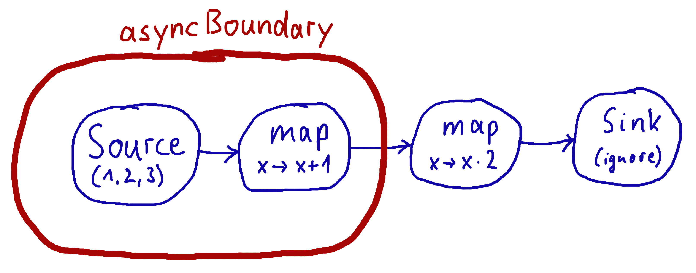

# Working with Graphs

## Introduction

在Akka流计算中，计算图不像线性计算那样使用流畅的DSL来表达，而是用更类似于图的DSL来编写，其目的是使图图（例如来自设计讨论中的笔记，或协议规范中的插图）到代码中的翻译更简单。在本节中，我们将深入探讨构建和重用图形的多种方法，并解释常见的陷阱以及如何避免这些陷阱。

只要你想执行任何一种扇形输入（"多输入"）或扇形输出（"多输出"）的操作，都需要用到图。考虑到线性Flows就像道路一样，我们可以把图形操作想象成路口：多个流在一个点上被连接起来。一些足够常见且符合Flows线性风格的操作符，例如concat（将两个流连在一起，这样第二个流在第一个流完成后被消耗掉），可能在Flow或Source本身上定义了速记方法，然而你应该记住，这些也是作为图结点来实现的

## Constructing Graphs

图形是由简单的Flows构建的，Flows作为图形中的线性连接，而连接点则作为Flows的扇形进入和扇形退出点。由于连接点具有基于其行为的有意义的类型，并使其成为显式元素，这些元素应该是相当直接的使用。

Akka Streams 以下连接点:

### Fan-out

*  Broadcast[T] - (1个输出) 将输入元素向每个输出发送
*  Balance[T] - (1个输入N个输出) 将输入元素发送到一个输出端口
*  UnzipWith[In,A,B,...] - (1个输入N个输出) 将每个输入值应用到一个函数， 发出N 个输出元素(N < 20)
* UnZip[A,B] - (1个输入2个输出) 将一个元组(A,B) 转换成 type A, type B 输出

### Fan-in

*  Merge[In] - (N个输入1个输出) 从输入中随即选取，逐一发送到输出
*  MergePreferred[In] - 和Merge类似，只是如果首选的port上有可用的元素，就会优先从中挑选，否则就会从其他port上随机选取
*  MergePrioritized[In] - 和Merge类似，但如果所有输入端口都有可用的元素，它就根据元素的优先级随机从中选择
*  MergeLatest[In] - (N个输入1个输出)  当第i个输入流发射元素时，发射列表中的第i个元素将被更新
*  MergeSequence[In] - (N个输入1个输出)  发出List[In], 输入的元素必须是能合并成List
*  ZipWith[A,B,...,Out] - (N个输入1个输出) 接收多个输入应用指定函数，给出一个输出元素
*  Zip[A,B] - (2个输入一个输出) 专门用于将A和B的输入流压缩成一个（A,B）元组流
*  Concat[A] - (2个输入一个输出) 连接两个流（先消耗一个，再消耗第二个）

GraphDSL DSL的目标之一是看起来类似于人们在白板上画图的样子，这样就可以很简单地把一个设计从白板翻译成代码，并且能够把这两者联系起来。让我们通过将下面的手绘图翻译成Akka Streams来说明这一点



这样的图很容易翻译成Graph DSL，因为每个线性元素对应一个Flow，每个圆圈对应一个Junction，或者一个Source或Sink（如果它是一个Flow的开始或结束）。结点必须总是用定义的类型参数来创建，否则将被推断为Nothing类型


```
val g = RunnableGraph.fromGraph(GraphDSL.create() { implicit builder: GraphDSL.Builder[NotUsed] =>
  import GraphDSL.Implicits._
  val in = Source(1 to 10)
  val out = Sink.ignore

  val bcast = builder.add(Broadcast[Int](2))
  val merge = builder.add(Merge[Int](2))

  val f1, f2, f3, f4 = Flow[Int].map(_ + 10)

  in ~> f1 ~> bcast ~> f2 ~> merge ~> f3 ~> out
  bcast ~> f4 ~> merge
  ClosedShape
})
```
在下面的例子中，我们准备了一个由两个平行流组成的图形，在这个图形中，我们重复使用了同一个Flow实例，但它将被正确地具体化为对应的Sources和Sinks之间的两个连接

```scala
RunnableGraph.fromGraph(GraphDSL.create(topHeadSink, bottomHeadSink)((_, _)) { implicit builder =>
  (topHS, bottomHS) =>
  import GraphDSL.Implicits._
  val broadcast = builder.add(Broadcast[Int](2))
  Source.single(1) ~> broadcast.in

  broadcast ~> sharedDoubler ~> topHS.in
  broadcast ~> sharedDoubler ~> bottomHS.in
  ClosedShape
})
```

在某些情况下，我们可能有一个图元素的列表，例如如果它们是动态创建的。如果这些图有类似的签名，我们可以构造一个图，把它们所有的物化值收集起来作为一个集合

```scala
val sinks = immutable
  .Seq("a", "b", "c")
  .map(prefix => Flow[String].filter(str => str.startsWith(prefix)).toMat(Sink.head[String])(Keep.right))

val g: RunnableGraph[Seq[Future[String]]] = RunnableGraph.fromGraph(GraphDSL.create(sinks) {
  implicit b => sinkList =>
    import GraphDSL.Implicits._
    val broadcast = b.add(Broadcast[String](sinkList.size))

    Source(List("ax", "bx", "cx")) ~> broadcast
    sinkList.foreach(sink => broadcast ~> sink)

    ClosedShape
})

val matList: Seq[Future[String]] = g.run()
```

## Constructing and combining Partial Graphs

有时不可能（或不需要）在一个地方构造整个计算图，而是在不同的地方构造它的所有不同阶段，最后将它们全部连接成一个完整的图并运行它。

这可以通过从给 GraphDSL.create 的函数中返回一个不同于 ClosedShape 的 Shape 来实现，例如 FlowShape(in, out)。请参阅 Predefined shapes 了解此类预定义形状的列表。将一个图形制作成一个RunnableGraph需要所有的端口都被连接，如果它们没有被连接，它将在构造时抛出一个异常，这有助于在处理图形时避免简单的布线错误。然而，部分图形允许您从执行内部布线的代码块中返回尚未连接的端口集。

让我们想象一下，我们想为用户提供一个专门的元素，给定 3 个输入，它将选择每个压缩后的三倍的最大 int 值。我们要暴露3个输入端口（未连接的源）和一个输出端口（未连接的汇）


```
val pickMaxOfThree = GraphDSL.create() { implicit b =>
  import GraphDSL.Implicits._

  val zip1 = b.add(ZipWith[Int, Int, Int](math.max _))
  val zip2 = b.add(ZipWith[Int, Int, Int](math.max _))
  zip1.out ~> zip2.in0

  UniformFanInShape(zip2.out, zip1.in0, zip1.in1, zip2.in1)
}

val resultSink = Sink.head[Int]

val g = RunnableGraph.fromGraph(GraphDSL.create(resultSink) { implicit b => sink =>
  import GraphDSL.Implicits._

  // importing the partial graph will return its shape (inlets & outlets)
  val pm3 = b.add(pickMaxOfThree)

  Source.single(1) ~> pm3.in(0)
  Source.single(2) ~> pm3.in(1)
  Source.single(3) ~> pm3.in(2)
  pm3.out ~> sink.in
  ClosedShape
})

val max: Future[Int] = g.run()
Await.result(max, 300.millis) should equal(3)
```

## Constructing Sources, Sinks and Flows from Partial Graphs

与其把一个局部图看作是尚未全部连接的流和连接点的集合，有时还不如把这样一个复杂的图看作是一个更简单的结构，如Source、Sink或Flow

事实上，这些概念可以表达为部分连接图的特例：

* Source 是一个只有一个输出的局部图，返回一个SourceShape
*  Sink 是一个只有一个输入的局部图，返回一个SinkShape
*  Flow 是一个有一个输入和一个输出的部分图形，返回一个FlowShape

能够将复杂的图形隐藏在简单的元素中，如Sink / Source / Flow，使您能够创建一个复杂的元素，并从那里将其视为线性计算的简单复合运算符

为了从一个图形中创建Source，我们使用了Source.fromGraph方法，要使用它，我们必须有一个Graph[SourceShape, T]。这是用GraphDSL.create构造的，并从传入的函数中返回一个SourceShape。单一的出口必须提供给SourceShape.of方法，并将成为 "这个Source运行前必须连接的水槽"。

请参考下面的例子，在这个例子中，我们创建了一个将两个数字压缩在一起的Source，可以看到这个图形构造的运行情况

```
val pairs = Source.fromGraph(GraphDSL.create() { implicit b =>
  import GraphDSL.Implicits._

  // prepare graph elements
  val zip = b.add(Zip[Int, Int]())
  def ints = Source.fromIterator(() => Iterator.from(1))

  // connect the graph
  ints.filter(_ % 2 != 0) ~> zip.in0
  ints.filter(_ % 2 == 0) ~> zip.in1

  // expose port
  SourceShape(zip.out)
})

val firstPair: Future[(Int, Int)] = pairs.runWith(Sink.head)
```

同样，也可以使用 SinkShape.of 来定义 Sink[T] ，在这种情况下，提供的值必须是 Inlet[T] 。为了定义一个Flow[T]，我们需要同时暴露一个入口和一个出口

```
val pairUpWithToString =
  Flow.fromGraph(GraphDSL.create() { implicit b =>
    import GraphDSL.Implicits._

    // prepare graph elements
    val broadcast = b.add(Broadcast[Int](2))
    val zip = b.add(Zip[Int, String]())

    // connect the graph
    broadcast.out(0).map(identity) ~> zip.in0
    broadcast.out(1).map(_.toString) ~> zip.in1

    // expose ports
    FlowShape(broadcast.in, zip.out)
  })

pairUpWithToString.runWith(Source(List(1)), Sink.head)
```

## Combining Sources and Sinks with simplified API

有一个简化的API，你可以用它来组合Source和Sink，比如：Broadcast[T], Balance[T], Merge[In]和Concat[A]，而不需要使用Graph DSL。Broadcast[T], Balance[T], Merge[In] 和 Concat[A]，而不需要使用 Graph DSL. combine方法负责在下面构造必要的图。在下面的例子中，我们将两个源合并成一个（扇形输入）

```
val sourceOne = Source(List(1))
val sourceTwo = Source(List(2))
val merged = Source.combine(sourceOne, sourceTwo)(Merge(_))

val mergedResult: Future[Int] = merged.runWith(Sink.fold(0)(_ + _))
```

同样的方法也可以用于Sink[T]，但在这种情况下，它将被扇出

```
val sendRmotely = Sink.actorRef(actorRef, "Done")
val localProcessing = Sink.foreach[Int](_ => /* do something useful */ ())

val sink = Sink.combine(sendRmotely, localProcessing)(Broadcast[Int](_))

Source(List(0, 1, 2)).runWith(sink)
```

## Building reusable Graph components

可以使用图DSL构建可重用的、封装的任意输入和输出端口的组件。

举个例子，我们将构建一个表示工人池的图结，其中一个工人表示为一个Flow[I,O,_]，即把类型为I的作业简单地转换为类型为O的结果（正如你已经看到的，这个流实际上可以包含一个复杂的图在里面）。我们的可重用的工人池结点不会保留入库作业的顺序（假设它们有一个合适的ID字段），它将使用Balance结点将作业调度给可用的工人。除此之外，我们的结点将具有一个 "快速通道"，这是一个专门的端口，可以发送优先级较高的作业。

总的来说，我们的结点将有两个类型为I的输入端口（用于普通和优先级作业）和一个类型为O的输出端口。为了表示这个接口，我们需要定义一个自定义的Shape。下面的行文展示了如何做到这一点

```
// A shape represents the input and output ports of a reusable
// processing module
case class PriorityWorkerPoolShape[In, Out](jobsIn: Inlet[In], priorityJobsIn: Inlet[In], resultsOut: Outlet[Out])
    extends Shape {

  // It is important to provide the list of all input and output
  // ports with a stable order. Duplicates are not allowed.
  override val inlets: immutable.Seq[Inlet[_]] =
    jobsIn :: priorityJobsIn :: Nil
  override val outlets: immutable.Seq[Outlet[_]] =
    resultsOut :: Nil

  // A Shape must be able to create a copy of itself. Basically
  // it means a new instance with copies of the ports
  override def deepCopy() =
    PriorityWorkerPoolShape(jobsIn.carbonCopy(), priorityJobsIn.carbonCopy(), resultsOut.carbonCopy())

}
```


## Predefined shapes

一般来说，一个自定义的Shape需要能够提供所有的输入和输出端口，能够复制自己，也能够从给定的端口创建一个新的实例。为了避免不必要的模板，我们提供了一些预定义的Shape

*  SourceShape、SinkShape、FlowShape为简单形状
*  UniformFanInShape和UniformFanOutShape用于具有多个相同类型输入（或输出）端口的结点
*  FanInShape1，FanInShape2，...，FanOutShape1，FanOutShape2，...，用于具有多个不同类型的输入（或输出）端口的结点

使用FanInShape DSL 来定义有两个输入端口和一个输出端口的图形:

```
import FanInShape.{ Init, Name }

class PriorityWorkerPoolShape2[In, Out](_init: Init[Out] = Name("PriorityWorkerPool"))
    extends FanInShape[Out](_init) {
  protected override def construct(i: Init[Out]) = new PriorityWorkerPoolShape2(i)

  val jobsIn = newInlet[In]("jobsIn")
  val priorityJobsIn = newInlet[In]("priorityJobsIn")
  // Outlet[Out] with name "out" is automatically created
}
```

现在我们已经有了一个Shape，我们可以连接一个代表工人池的Graph。首先，我们将使用 MergePreferred 合并传入的普通作业和优先作业，然后将作业发送到 Balance junction，该 Balance junction 将向可配置数量的 Worker（flow）扇形输出，最后我们将所有这些结果合并在一起，并通过我们唯一的输出端口发送出去。这用下面的代码来表示

```
object PriorityWorkerPool {
  def apply[In, Out](
      worker: Flow[In, Out, Any],
      workerCount: Int): Graph[PriorityWorkerPoolShape[In, Out], NotUsed] = {

    GraphDSL.create() { implicit b =>
      import GraphDSL.Implicits._

      val priorityMerge = b.add(MergePreferred[In](1))
      val balance = b.add(Balance[In](workerCount))
      val resultsMerge = b.add(Merge[Out](workerCount))

      // After merging priority and ordinary jobs, we feed them to the balancer
      priorityMerge ~> balance

      // Wire up each of the outputs of the balancer to a worker flow
      // then merge them back
      for (i <- 0 until workerCount)
        balance.out(i) ~> worker ~> resultsMerge.in(i)

      // We now expose the input ports of the priorityMerge and the output
      // of the resultsMerge as our PriorityWorkerPool ports
      // -- all neatly wrapped in our domain specific Shape
      PriorityWorkerPoolShape(
        jobsIn = priorityMerge.in(0),
        priorityJobsIn = priorityMerge.preferred,
        resultsOut = resultsMerge.out)
    }

  }

}
```

现在我们需要做的就是在图中使用我们的自定义结点。下面的代码使用普通字符串模拟了一些简单的worker和job，并打印出结果。实际上我们使用两次add()使用了我们的worker pool结的两个实例

```
val worker1 = Flow[String].map("step 1 " + _)
val worker2 = Flow[String].map("step 2 " + _)

RunnableGraph
  .fromGraph(GraphDSL.create() { implicit b =>
    import GraphDSL.Implicits._

    val priorityPool1 = b.add(PriorityWorkerPool(worker1, 4))
    val priorityPool2 = b.add(PriorityWorkerPool(worker2, 2))

    Source(1 to 100).map("job: " + _) ~> priorityPool1.jobsIn
    Source(1 to 100).map("priority job: " + _) ~> priorityPool1.priorityJobsIn

    priorityPool1.resultsOut ~> priorityPool2.jobsIn
    Source(1 to 100).map("one-step, priority " + _) ~> priorityPool2.priorityJobsIn

    priorityPool2.resultsOut ~> Sink.foreach(println)
    ClosedShape
  })
  .run()
```


## Bidirectional Flows

个经常有用的图拓扑结构是两个流向相反的流向。以一个编解码器操作者为例，该操作者将传出的消息串行化，并将传入的八位数流反串行化。另一个这样的操作符可以添加一个帧协议，将长度头附加到出站数据上，并将传入的帧解析回原来的八位数流块。这两个操作符是要组成的，作为协议栈的一部分，在另一个上面应用一个。为此存在一种特殊的类型BidiFlow，它是一个正好有两个开放的入口和两个开放的出口的图形。相应的形状叫做BidiShape，是这样定义的

```
/**
 * A bidirectional flow of elements that consequently has two inputs and two
 * outputs, arranged like this:
 *
 * {{{
 *        +------+
 *  In1 ~>|      |~> Out1
 *        | bidi |
 * Out2 <~|      |<~ In2
 *        +------+
 * }}}
 */
final case class BidiShape[-In1, +Out1, -In2, +Out2](
    in1: Inlet[In1 @uncheckedVariance],
    out1: Outlet[Out1 @uncheckedVariance],
    in2: Inlet[In2 @uncheckedVariance],
    out2: Outlet[Out2 @uncheckedVariance])
    extends Shape {
  override val inlets: immutable.Seq[Inlet[_]] = in1 :: in2 :: Nil
  override val outlets: immutable.Seq[Outlet[_]] = out1 :: out2 :: Nil

  /**
   * Java API for creating from a pair of unidirectional flows.
   */
  def this(top: FlowShape[In1, Out1], bottom: FlowShape[In2, Out2]) = this(top.in, top.out, bottom.in, bottom.out)

  override def deepCopy(): BidiShape[In1, Out1, In2, Out2] =
    BidiShape(in1.carbonCopy(), out1.carbonCopy(), in2.carbonCopy(), out2.carbonCopy())

}
```

双向流的定义就像上述编解码器演示的单向流一样

```
trait Message
case class Ping(id: Int) extends Message
case class Pong(id: Int) extends Message

def toBytes(msg: Message): ByteString = {
  implicit val order = ByteOrder.LITTLE_ENDIAN
  msg match {
    case Ping(id) => ByteString.newBuilder.putByte(1).putInt(id).result()
    case Pong(id) => ByteString.newBuilder.putByte(2).putInt(id).result()
  }
}

def fromBytes(bytes: ByteString): Message = {
  implicit val order = ByteOrder.LITTLE_ENDIAN
  val it = bytes.iterator
  it.getByte match {
    case 1     => Ping(it.getInt)
    case 2     => Pong(it.getInt)
    case other => throw new RuntimeException(s"parse error: expected 1|2 got $other")
  }
}

val codecVerbose = BidiFlow.fromGraph(GraphDSL.create() { b =>
  // construct and add the top flow, going outbound
  val outbound = b.add(Flow[Message].map(toBytes))
  // construct and add the bottom flow, going inbound
  val inbound = b.add(Flow[ByteString].map(fromBytes))
  // fuse them together into a BidiShape
  BidiShape.fromFlows(outbound, inbound)
})

// this is the same as the above
val codec = BidiFlow.fromFunctions(toBytes _, fromBytes _)
```

第一个版本类似于部分图构造函数，而对于函数1:1变换的简单情况，有一个简洁的方便方法，如最后一行所示。这两个函数的实现也不难

```
def toBytes(msg: Message): ByteString = {
  implicit val order = ByteOrder.LITTLE_ENDIAN
  msg match {
    case Ping(id) => ByteString.newBuilder.putByte(1).putInt(id).result()
    case Pong(id) => ByteString.newBuilder.putByte(2).putInt(id).result()
  }
}

def fromBytes(bytes: ByteString): Message = {
  implicit val order = ByteOrder.LITTLE_ENDIAN
  val it = bytes.iterator
  it.getByte match {
    case 1     => Ping(it.getInt)
    case 2     => Pong(it.getInt)
    case other => throw new RuntimeException(s"parse error: expected 1|2 got $other")
  }
}
```

通过这种方式，你可以集成任何其他序列化库，将一个对象变成一个字节序列。

```

```

我们谈到的另一个操作符涉及的内容更多一些，因为反转帧协议意味着任何接收到的字节块可能对应于零或更多的消息。这一点最好用GraphStage来实现（另见GraphStage的自定义处理）

```
val framing = BidiFlow.fromGraph(GraphDSL.create() { b =>
  implicit val order = ByteOrder.LITTLE_ENDIAN

  def addLengthHeader(bytes: ByteString) = {
    val len = bytes.length
    ByteString.newBuilder.putInt(len).append(bytes).result()
  }

  class FrameParser extends GraphStage[FlowShape[ByteString, ByteString]] {

    val in = Inlet[ByteString]("FrameParser.in")
    val out = Outlet[ByteString]("FrameParser.out")
    override val shape = FlowShape.of(in, out)

    override def createLogic(inheritedAttributes: Attributes): GraphStageLogic = new GraphStageLogic(shape) {

      // this holds the received but not yet parsed bytes
      var stash = ByteString.empty
      // this holds the current message length or -1 if at a boundary
      var needed = -1

      setHandler(out, new OutHandler {
        override def onPull(): Unit = {
          if (isClosed(in)) run()
          else pull(in)
        }
      })
      setHandler(in, new InHandler {
        override def onPush(): Unit = {
          val bytes = grab(in)
          stash = stash ++ bytes
          run()
        }

        override def onUpstreamFinish(): Unit = {
          // either we are done
          if (stash.isEmpty) completeStage()
          // or we still have bytes to emit
          // wait with completion and let run() complete when the
          // rest of the stash has been sent downstream
          else if (isAvailable(out)) run()
        }
      })

      private def run(): Unit = {
        if (needed == -1) {
          // are we at a boundary? then figure out next length
          if (stash.length < 4) {
            if (isClosed(in)) completeStage()
            else pull(in)
          } else {
            needed = stash.iterator.getInt
            stash = stash.drop(4)
            run() // cycle back to possibly already emit the next chunk
          }
        } else if (stash.length < needed) {
          // we are in the middle of a message, need more bytes,
          // or have to stop if input closed
          if (isClosed(in)) completeStage()
          else pull(in)
        } else {
          // we have enough to emit at least one message, so do it
          val emit = stash.take(needed)
          stash = stash.drop(needed)
          needed = -1
          push(out, emit)
        }
      }
    }
  }

  val outbound = b.add(Flow[ByteString].map(addLengthHeader))
  val inbound = b.add(Flow[ByteString].via(new FrameParser))
  BidiShape.fromFlows(outbound, inbound)
})
```

有了这些实现，我们就可以建立一个协议栈并进行测试:

```
/* construct protocol stack
 *         +------------------------------------+
 *         | stack                              |
 *         |                                    |
 *         |  +-------+            +---------+  |
 *    ~>   O~~o       |     ~>     |         o~~O    ~>
 * Message |  | codec | ByteString | framing |  | ByteString
 *    <~   O~~o       |     <~     |         o~~O    <~
 *         |  +-------+            +---------+  |
 *         +------------------------------------+
 */
val stack = codec.atop(framing)

// test it by plugging it into its own inverse and closing the right end
val pingpong = Flow[Message].collect { case Ping(id) => Pong(id) }
val flow = stack.atop(stack.reversed).join(pingpong)
val result = Source((0 to 9).map(Ping)).via(flow).limit(20).runWith(Sink.seq)
Await.result(result, 1.second) should ===((0 to 9).map(Pong))
```

这个例子演示了如何将BidiFlow子图挂在一起，也可以用.reverse方法转过来。该测试模拟了一个网络通信协议的双方，而不需要实际打开一个网络连接--流量可以直接连接


## Accessing the materialized value inside the Graph

在某些情况下，可能需要反馈Graph的物化值（部分的、封闭的或支持Source、Sink、Flow或BidiFlow）。这可以通过使用 builder.materializedValue 来实现，它给出了一个 Outlet，可以在图形中作为普通的源或出口使用，并且最终会发出物化值。如果在多个地方需要物化值，可以任意多次调用materializedValue来获取所需的网点数量

```
import GraphDSL.Implicits._
val foldFlow: Flow[Int, Int, Future[Int]] = Flow.fromGraph(GraphDSL.create(Sink.fold[Int, Int](0)(_ + _)) {
  implicit builder => fold =>
    FlowShape(fold.in, builder.materializedValue.mapAsync(4)(identity).outlet)
})
```

注意不要引入一个循环，在这个循环中，物化的价值实际上是贡献给物化的价值的。下面的例子演示了一个案例，其中折线的物化未来被反馈到折线本身

```
import GraphDSL.Implicits._
// This cannot produce any value:
val cyclicFold: Source[Int, Future[Int]] =
  Source.fromGraph(GraphDSL.create(Sink.fold[Int, Int](0)(_ + _)) { implicit builder => fold =>
    // - Fold cannot complete until its upstream mapAsync completes
    // - mapAsync cannot complete until the materialized Future produced by
    //   fold completes
    // As a result this Source will never emit anything, and its materialited
    // Future will never complete
    builder.materializedValue.mapAsync(4)(identity) ~> fold
    SourceShape(builder.materializedValue.mapAsync(4)(identity).outlet)
  })
```


## Graph cycles, liveness and deadlocks

有界流拓扑中的循环需要特别的考虑，以避免潜在的死锁和其他活泼性问题。本节展示了流处理图中存在反馈弧可能产生的问题的几个例子。

在下面的例子中，创建了可运行的图，但没有运行，因为每个图都有一些问题，启动后会出现死锁。源变量没有定义，因为对于描述的问题，元素的性质和数量并不重要。

第一个例子演示了一个包含天真循环的图。该图从源头获取元素，打印出来，然后将这些元素广播给消费者（我们只是暂时使用了Sink.ignore）和反馈弧，通过Merge结点合并回主流

Note

图形DSL允许连接箭头反转，这在写循环时特别方便--我们将看到有一些情况下，这非常有用

```scala
// WARNING! The graph below deadlocks!
RunnableGraph.fromGraph(GraphDSL.create() { implicit b =>
  import GraphDSL.Implicits._

  val merge = b.add(Merge[Int](2))
  val bcast = b.add(Broadcast[Int](2))

  source ~> merge ~> Flow[Int].map { s => println(s); s } ~> bcast ~> Sink.ignore
            merge                    <~                      bcast
  ClosedShape
})
```

运行这个程序，我们观察到，在打印了几个数字之后，没有更多的元素被记录到控制台--所有的处理在一段时间后停止。经过一番调查，我们观察到:

*  通过源头的合并，我们增加了循环中流动的元素数量
*  通过向循环播放，我们并没有减少循环中的元素数量

这两个条件是一个典型的 "鸡和蛋 "问题。解决的办法是在循环中注入一个独立于源的初始元素。我们通过在倒弧上使用Concat结点来实现这一目的，该结点使用Source.single注入一个单元素

```scala
RunnableGraph.fromGraph(GraphDSL.create() { implicit b =>
  import GraphDSL.Implicits._

  val zip = b.add(ZipWith((left: Int, right: Int) => left))
  val bcast = b.add(Broadcast[Int](2))
  val concat = b.add(Concat[Int]())
  val start = Source.single(0)

  source ~> zip.in0
  zip.out.map { s => println(s); s } ~> bcast ~> Sink.ignore
  zip.in1 <~ concat <~ start
             concat         <~          bcast
  ClosedShape
})
```

当我们运行上面的例子时，我们看到，处理开始，从未停止。从这个例子中得到的重要启示是，平衡循环往往需要一个初始的 "启动 "元素注入到循环中


